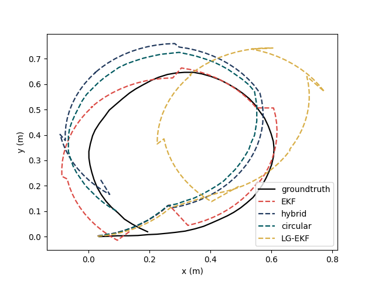

# Circular Localization Simulation

The three simulation plots in the paper is generated by `sim_trajectory.py`, `sim_dynamics.py`, and `sim_initial.py`.

### Trajectory

### Dynamics

### Initial Orientation

